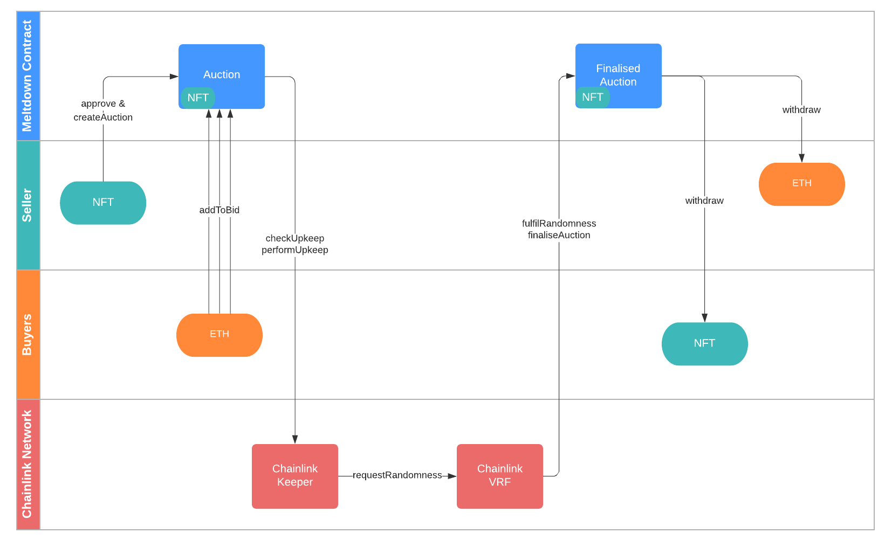

# 🕯️ NFT Meltdown 

This repository contains the core smart contracts for Meltdown, an NFT candle-auction platform.

Meltdown was written using [dapptools](https://github.com/dapphub/dapptools), a suite of tools used to develop on Ethereum. 

The Meltdown frontend code can be found [here](https://github.com/VasilyGerrans/chainlink-fall-2021-hackathon).

## Meltdown Auction Lifetime



1. **Auction Creation**
- Seller `approves` *Meltdown* to spend ERC721
- Seller calls `createAuction` specifying auction parameters

2. **Bidding**
- Buyers can bid on the auction by calling `addToBid` with some ETH value
- There are two phases of bidding
    - Normal: During the start of the auction, each bid is guaranteed to count
    - Closing: The auction can end at any time during the closing window. So bids are not guaranteed to contribute to the bidder's final amount. 

3. **Finalisation**
- `checkUpkeep` returns `true` once the auction is finished.
- This prompts a Chainlink Keeper node to call `performUpkeep`, which then calls `requestRandomness`.
- `requestRandomness` requests a random `uint256` from Chainlink VRF.
- VRF calls `fulfilRandomness` callback in the Meltdown contract, which calls `finaliseAuction` with the random `uint`. 
- We use the random `uint` as a fair, uniformally distributed variable to find where the auction ends.  

4. **Withdraw**
- The highest bidder at the point where the auction finalised can withdraw the sellers `ERC721`
- The `ERC721` seller can withdraw the cumulative bid of the auction winner. 
- The unsuccessful bidders can withdraw all their bidded `ETH`. 

## Installation

First install [dapptools](https://github.com/dapphub/dapptools)
```
git clone https://github.com/calebcheng00/cl-fall-2021
cd cl-fall-2021
dapp build
```

## Running Tests

This repository contains comprehensive [test cases](https://github.com/calebcheng00/cl-fall-2021/tree/main/src/test) enabled by the comprehensive testing framework in `dapptools`.

`cd` into the repository, then run:

```
dapp test
```
